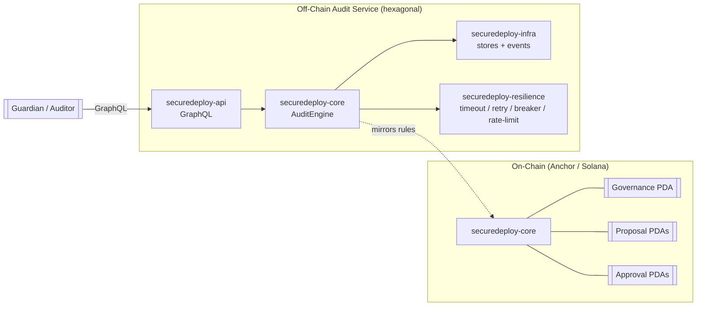
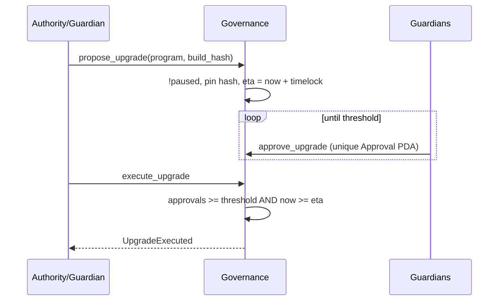

# SecureDeploySol

> A **hardened Solana upgrade-governance** program — guardian multisig +
> timelock + verifiable build-hash pinning — with an accompanying off-chain
> **deployment-security audit service**. Ships with a full threat model
> ([AUDIT.md](AUDIT.md)) mapping every handler to the Solana attack class it
> defends against.

[](.github/workflows/ci.yml)
[](https://www.anchor-lang.com/)
[%20%2F%201.95%20(bpf)-orange)](rust-toolchain.toml)
[](#test-results)
[](#license)

---

## Table of Contents

- [Overview](#overview)
- [Why This Design](#why-this-design)
- [Architecture](#architecture)
- [On-Chain Program](#on-chain-program)
- [Off-Chain Audit Service](#off-chain-audit-service)
- [Upgrade Lifecycle](#upgrade-lifecycle)
- [Security Model](#security-model)
- [Getting Started](#getting-started)
- [GraphQL API](#graphql-api)
- [Benchmarks & Complexity](#benchmarks--complexity)
- [Test Results](#test-results)
- [Project Layout](#project-layout)
- [License](#license)

## Overview

Uncontrolled program-upgrade authority is one of the largest risks in the Solana
ecosystem: a single compromised key can replace live program code. SecureDeploySol
replaces that single key with **governed, timelocked, verifiable** upgrades:

- **Guardian multisig** — an upgrade needs `threshold` distinct guardian
  approvals (each recorded as a unique PDA, so double-voting is impossible).
- **Timelock** — approved proposals cannot execute until an `eta` elapses.
- **Build-hash pinning** — each proposal fixes the sha256 of the artifact, so
  observers can verify the deployed binary matches the reviewed one.
- **Emergency pause** + **two-step authority transfer** for operational safety.

The off-chain service indexes proposals, tracks security **findings** against a
Solana attack-class taxonomy, mirrors the governance rules, and exposes
everything over a resilient GraphQL API.

## Why This Design

Every account struct and handler is annotated with the specific attack class it
defends against; see the full [threat-model matrix](AUDIT.md). The program is a
*reference* for building programs that are safe against account confusion,
reinitialization, integer overflow, arbitrary CPI, PDA seed collision, type
cosplay, and unbounded-account DoS.

## Architecture



## On-Chain Program

Program id: `9x3Dcnv4yXcGL6PZaPyRLbjnMfRJ4v1Yqkf5fbX8ToYA`

| Instruction | Purpose |
|---|---|
| `initialize` | Create governance with guardians, threshold, timelock (reinit-guarded) |
| `set_guardians` | Rotate the guardian set / threshold (authority-only, re-validated) |
| `set_paused` | Emergency pause toggle (authority-only) |
| `transfer_authority` / `accept_authority` | Two-step authority handoff |
| `propose_upgrade` | Pin a program id + build hash; compute the timelock `eta` |
| `approve_upgrade` | Guardian vote via a unique `Approval` PDA (no double-vote) |
| `execute_upgrade` | Execute once threshold **and** timelock are satisfied |
| `cancel_proposal` | Authority cancels a pending proposal |

PDAs: governance `["governance"]`, proposal `["proposal", id_le]`, approval
`["approval", id_le, guardian]`. Guardian sets are bounded by
`MAX_GUARDIANS = 16`.

## Off-Chain Audit Service

| Crate | Responsibility |
|---|---|
| `securedeploy-types` | Newtypes (`ProgramId`, `ProposalId`), threat taxonomy, governance validation, sha256 `BuildHash` — mirrors the on-chain rules |
| `securedeploy-resilience` | Testable clock, timeouts, retry + backoff, circuit breaker, token-bucket rate limiter |
| `securedeploy-core` | Domain records, ports (`ProposalStore`, `FindingStore`, `EventSink`), and the generic `AuditEngine` |
| `securedeploy-infra` | In-memory stores (DashMap), broadcast event sink, optional Postgres proposal store (`postgres` feature) |
| `securedeploy-api` | `async-graphql` schema: queries, mutations, subscriptions |
| `securedeploy-node` | Composition root: clap config, JSON tracing, Prometheus metrics, axum server, demo |

## Upgrade Lifecycle



## Security Model

- **No `unwrap`/`panic` on runtime paths**; every fallible boundary returns `Result`.
- **Reinitialization guard**: `init` on governance + per-guardian approval PDAs.
- **Overflow-checked** release profile + `checked_add` on counters.
- **Access control** via `has_one = authority` and signer requirements.
- **Bounded accounts** prevent rent-exhaustion DoS.
- `#![forbid(unsafe_code)]` across every off-chain crate.

Full mapping in [AUDIT.md](AUDIT.md).

## Getting Started

### Off-chain service

```bash
cargo test --workspace --all-features        # full test suite
cargo run -p securedeploy-node -- demo        # propose → approve → execute demo
cargo run -p securedeploy-node -- serve       # GraphQL on :8080 (playground at /graphql)
```

Config via flags or env: `SD_AUTHORITY`, `SD_GUARDIANS`, `SD_THRESHOLD`,
`SD_TIMELOCK`, `SD_BIND_ADDR`, `SD_RATE_LIMIT_RPS`.

### On-chain program

```bash
cd anchor
cargo test          # host-side logic tests
anchor build        # BPF/SBF build (Anchor 0.30)
```

### Docker

```bash
docker compose up node prometheus                          # service + metrics
docker compose --profile db up                             # add Postgres
docker build -f Dockerfile.anchor -t securedeploy-prog .   # verifiable program build
```

## GraphQL API

- **Queries**: `health`, `config`, `proposal(id)`, `proposals`, `finding(id)`, `findings`, `stats`
- **Mutations**: `proposeUpgrade`, `approveUpgrade`, `executeUpgrade`, `cancelProposal`, `raiseFinding`, `setPaused`
- **Subscriptions**: `events` (proposal created/approved/executed/cancelled, finding raised, pause changed)

A Postman collection is in
[`postman/SecureDeploySol.postman_collection.json`](postman/SecureDeploySol.postman_collection.json).

## Benchmarks & Complexity

| Operation | Complexity | Measured |
|---|---|---|
| Build-hash (sha256, 4 KiB) | $O(n)$ in artifact size | ≈ 3.46 µs |
| Guardian validation | $O(k^2)$, $k \le 16$ | constant-bounded |
| Execution gate check | $O(1)$ | constant-time |
| Engine propose / approve / execute | $O(1)$ | excluding store I/O |

Run `cargo bench -p securedeploy-types` to reproduce.

## Test Results

- **On-chain**: 12 tests (guardian validation, threshold bounds, account sizing).
- **Off-chain**: 44 tests (unit + property + engine behaviour + GraphQL flow).
- **Total: 56 passing.** `cargo fmt` + `cargo clippy --all-targets --all-features -D warnings` clean.

```text
off-chain: 44 passed; 0 failed
on-chain:  12 passed; 0 failed
```

## Project Layout

```
SecureDeploySol/
├── anchor/                          # on-chain Anchor workspace
│   └── programs/securedeploy-core/  # hardened upgrade-governance program
├── crates/                          # off-chain hexagonal audit service
│   ├── securedeploy-types/
│   ├── securedeploy-resilience/
│   ├── securedeploy-core/
│   ├── securedeploy-infra/
│   ├── securedeploy-api/
│   └── securedeploy-node/
├── migrations/                      # partitioned Postgres schema
├── monitoring/                      # Prometheus config
├── postman/                         # GraphQL collection
├── AUDIT.md                         # threat model / attack-class matrix
├── EVALUATION.md                    # 28-guideline self-assessment
└── Dockerfile / Dockerfile.anchor / docker-compose.yml
```

## License

MIT.
